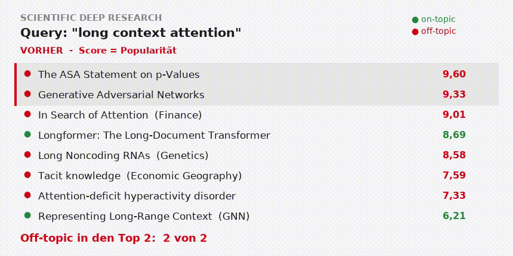
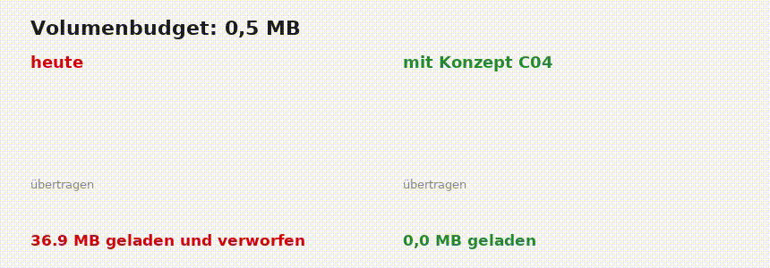
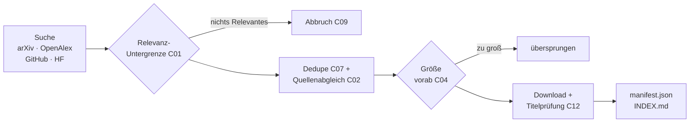

# Scientific Deep Research (`/sdr`)

**An agent skill that turns any topic into a local, citable research library** —
real papers (PDFs), repos and models, downloaded into a folder with a
machine-readable manifest, so your coding agent works from ground truth
instead of hallucinating sources.

Works with **Claude Code, Codex, Antigravity, Gemini CLI, Hermes** and any
agent CLI that can read a Markdown skill and run Python. No dependencies —
stdlib-only Python 3.8+, no API keys required.

```
/sdr how do modern LLMs handle long context — architectures, KV cache, inference speed
```

---

## Warum dieses Release existiert

SDR lieferte echte Quellen — aber nicht immer die *richtigen*. Das Scoring
kannte keinen Relevanzbegriff, widersprüchliche Metadaten wurden still
aufgelöst, fehlgeschlagene Downloads verschwanden spurlos, und das
Volumenbudget lud weiter, statt abzubrechen.

**Das Kernproblem, live gemessen.** Die Query `long context attention`
lieferte als acht bestbewertete Treffer unter anderem „In Search of
Attention" (Journal of Finance), „Long Noncoding RNAs" (Genetik) und
„Attention-deficit hyperactivity disorder" (The Lancet). Der Score gewichtete
Zitationen, Frische und Venue — aber nicht, ob ein Dokument zum Thema passt.



Dieselbe Query nach dem Umbau: die zwei besten Treffer sind „Representing
Long-Range Context for Graph Neural Networks" und „HyperAttention:
Long-context Attention in Near-Linear Time". Off-topic in den Top 2: von
**2 von 2** auf **0 von 2**.



Mit einem Budget von 0,5 MB wurden vorher vier Repositories vollständig
geklont und anschließend gelöscht — 36,9 MB übertragen, nichts behalten.
Heute wird die Größe vorab geprüft und übersprungen.

---

## Kurzfassung der Patches

| ID | Was sich ändert | Wo |
|---|---|---|
| **C01** | Relevanz wird messbar: IDF-gewichtete Termabdeckung in Titel (doppelt gewichtet) und Abstract, als Score-Bestandteil **und** als leniente Untergrenze | `search.py` |
| **C02** | Zwei Quellen derselben Arbeit werden verglichen. Unter 0,50 Token-Übereinstimmung wird geflaggt statt still aufgelöst; die autoritative Quelle gewinnt, beide Varianten bleiben im Manifest | `search.py` |
| **C04** | Repogöße wird **vor** dem Klonen geprüft, die Schleife bricht bei Überschreitung ab, gezählt werden belegte Plattenblöcke statt logischer Bytes | `fetch.py`, `common.py` |
| **C05** | Fehlgeschlagene Downloads bleiben als `link_only`-Eintrag mit `failure_reason` erhalten, statt zu verschwinden | `fetch.py` |
| **C07** | Dedupe über DOI-Aliase, arXiv- und OpenAlex-IDs, Repos ohne Owner-Bestandteil | `search.py` |
| **C08** | 31 Tests mit aufgezeichneten Fixtures, kein Netzwerk; CI für Python 3.8–3.12 | `tests/`, `.github/` |
| **C09** | Ein Lauf bricht ab, wenn kein Treffer einen Inhaltsterm der Query enthält | `search.py` |
| **C11** | Zitationsgraph-Expansion respektiert `--since` | `openalex.py` |
| **C12** | Heruntergeladene PDFs werden gegen ihren Titel geprüft (Token-Abdeckung unter 0,70 → `pdf_unverified`) | `textextract.py`, `fetch.py` |
| **C16** | Fünf harte Regeln für den Agenten | `SKILL.md` |

---

## Gemessenes Ergebnis

Dieselben Szenarien, vorher und nachher. Query: `long context attention`.

| Metrik | vorher | nachher |
|---|---:|---:|
| Off-topic in den Top 2 | 2 von 2 | **0 von 2** |
| Off-topic in den Top 8 | 0,75 | **0,25** |
| Verschiedene Scores unter arXiv-Treffern | 4 | **7** |
| Unsinns-Query: Treffer / abgebrochen | 10 / nein | **0 / ja** |
| Clone-Versuche bei `--max-mb 0.5` | 6 | **1** |
| Geladen und wieder gelöscht | 4 | **0** |
| Doppelte Repos | 1 | **0** |
| Quellenübergreifende Dubletten | 3 | **0** |
| Testsuite / CI | nein / nein | **ja / ja** |

---

## Ablauf

<details>
<summary>Prüfpunkte der Pipeline (Diagramm)</summary>



</details>

In Worten: Suchen, Relevanz prüfen, Dubletten zusammenführen und
Quellenwidersprüche markieren, Größe vor dem Laden prüfen, danach Inhalt
gegen den Titel verifizieren — dann Manifest schreiben. Fehlgeschlagene
Downloads landen als `link_only` im Manifest (C05).

---

## Neue Felder

Jedes Dokument in `manifest.json` trägt jetzt:

| Feld | Bedeutung |
|---|---|
| `relevance` | 0–1, IDF-gewichteter Anteil der Query-Terme in Titel/Abstract |
| `score` | Gesamtwertung **mit** Relevanz |
| `legacy_score` | Der alte Wert, damit Läufe vergleichbar bleiben |
| `status` | `downloaded` · `link_only` · `pdf_unverified` |
| `failure_reason` | z. B. `http_403`, `no_pdf_url`, `not_a_pdf`, `clone_failed` |
| `conflict` / `conflict_fields` / `conflict_detail` | Quellenwiderspruch mit beiden Varianten |
| `title_match` | Trefferquote des PDF-Inhalts gegen den Titel |

`manifest.json` hat zusätzlich `schema_version: 2` und einen `report`-Block
mit `conflicts`, `link_only`, `pdf_unverified`, `mean_relevance` und
`offtopic_dropped`.

**Der Score ist kein Relevanzbeweis.** Ein hoher Wert bedeutet viele
Zitationen, frisches Datum, gute Venue — nicht, dass das Dokument zum Thema
passt. Für die thematische Passung steht `relevance`.

---

## Regeln für den Agenten

1. **Score ist kein Relevanzbeweis** — lies `relevance`.
2. **Zitiere nur Dokumente mit `local_path`.** `link_only` und
   `pdf_unverified` dürfen als Hinweis genannt, aber nicht als gelesene
   Quelle zitiert werden.
3. **Bei `aborted: true` wird keine Bibliothek geschrieben.**
4. **Jeder `conflict: true` muss sichtbar gemacht werden.**
5. **Unter einer mittleren Relevanz von 0,5 wird keine Literaturübersicht
   geschrieben** — Query verengen, neu suchen.

---

## Anti-Halluzination

- Die **Skripte** suchen und laden (live API-Ergebnisse); der **Agent**
  orchestriert und kuratiert. Keine Quelle stammt aus Modellgedächtnis.
- PDFs werden über Magic Bytes validiert und anschließend gegen ihren Titel
  geprüft — HTML-Fehlerseiten und falsch verlinkte PDFs fallen auf.
- Widersprechen sich zwei Quellen, wird das **sichtbar gemacht** statt
  aufgelöst.
- Fehlgeschlagene Downloads bleiben als `link_only`-Eintrag mit Grund
  erhalten — nichts verschwindet stillschweigend.
- `manifest.json` listet jedes Dokument mit seinem `local_path`;
  nachgelagerte Agenten zitieren nur aus dieser Liste.
- Der Seriousness-Score liegt als überprüfbarer Code in
  [`scripts/search.py`](scripts/search.py) — einstellbar per PR, nicht per
  Prompt.

---

## Effort levels — Budgets, keine Dokumentzahlen

| Effort | Dauer | Runden | Expansion | Volumen |
|---|---|---|---|---|
| `low` | ~2 min | 1 | — | ~100 MB |
| `medium` | ~10 min | ≤2 | — | ~500 MB |
| `high` | ~25 min | ≤3 | Zitationen der Top-Papers | ~2 GB |
| `xhigh` | ~45 min | ≤5 | + Literaturverzeichnisse | ~5 GB |
| `ultra` | offen | bis trocken | vollständiger Zitations-Snowball | unbegrenzt* |

*ultra erfordert explizite Bestätigung und läuft, bis zwei aufeinanderfolgende
Runden nichts Neues finden (Neuheit < 10 %), dann folgt ein
Vollständigkeitsdurchlauf.

Das Volumenbudget zählt **belegte Plattenblöcke**, nicht logische
Dateigrößen — bei vielen kleinen Dateien ist das der ehrlichere Wert.

## Full vs. Light version

| | `full` (Standard) | `light` (`--light`) |
|---|---|---|
| Papers | originale PDFs | extrahierter Text als Markdown |
| Repos | shallow clone | nur README |
| Größe | GB | **10–50x kleiner** |
| Geeignet für | Archiv, exakte Abbildungen und Formeln | wenig Plattenplatz, **Agent-Brains** |

Die Extraktion im Light Mode ist deterministischer Code, kein Nachtippen
durch das LLM: arXiv-HTML → `pdftotext` → Abstract-Fallback, mit im
Frontmatter festgehaltener Methode.

## Install

```bash
git clone https://github.com/legifx/scientific-deep-research
cd scientific-deep-research && ./install.sh
```

Der Installer kopiert den Skill nach `~/.agents/skills/scientific-deep-research`
und verlinkt ihn optional für Claude Code (`~/.claude/skills/`).

## Scripts (einzeln nutzbar)

```bash
python3 scripts/search.py -q "kv cache compression" --effort medium --since 2025 --out r1.json
python3 scripts/fetch.py --in r1.json --dest ./research/kv-cache --max-mb 500 --top 20
python3 scripts/manifest.py --dest ./research/kv-cache --topic "KV cache" --effort medium
```

Optionale Umgebungsvariablen: `GITHUB_TOKEN` (höhere Rate-Limits),
`SDR_CONTACT_EMAIL` (höflicher User-Agent für OpenAlex).

## Tests

```bash
python3 -m unittest discover -s tests -t tests
```

31 Tests, alle mit aufgezeichneten Fixtures — **kein Netzwerk**. Jeder
gemeldete Fehler hat einen eigenen Regressionstest. CI läuft auf Python
3.8 bis 3.12.

## Quellen

| Quelle | Was | Key nötig |
|---|---|---|
| [arXiv](https://arxiv.org) | Preprints, direkte PDFs | nein |
| [OpenAlex](https://openalex.org) | 250M+ Werke, Zitationen, Venues, OA-Links, Zitationsgraph | nein |
| [GitHub](https://github.com) | Implementierungen (Sterne ≈ Verbreitung) | optional |
| [Hugging Face](https://huggingface.co) | Modelle und Datensätze (standardmäßig nur als Link) | nein |

Nur offizielle APIs und Open-Access-Bestände — kein Scraping, keine
Umgehung von Bezahlschranken.

## License

MIT
